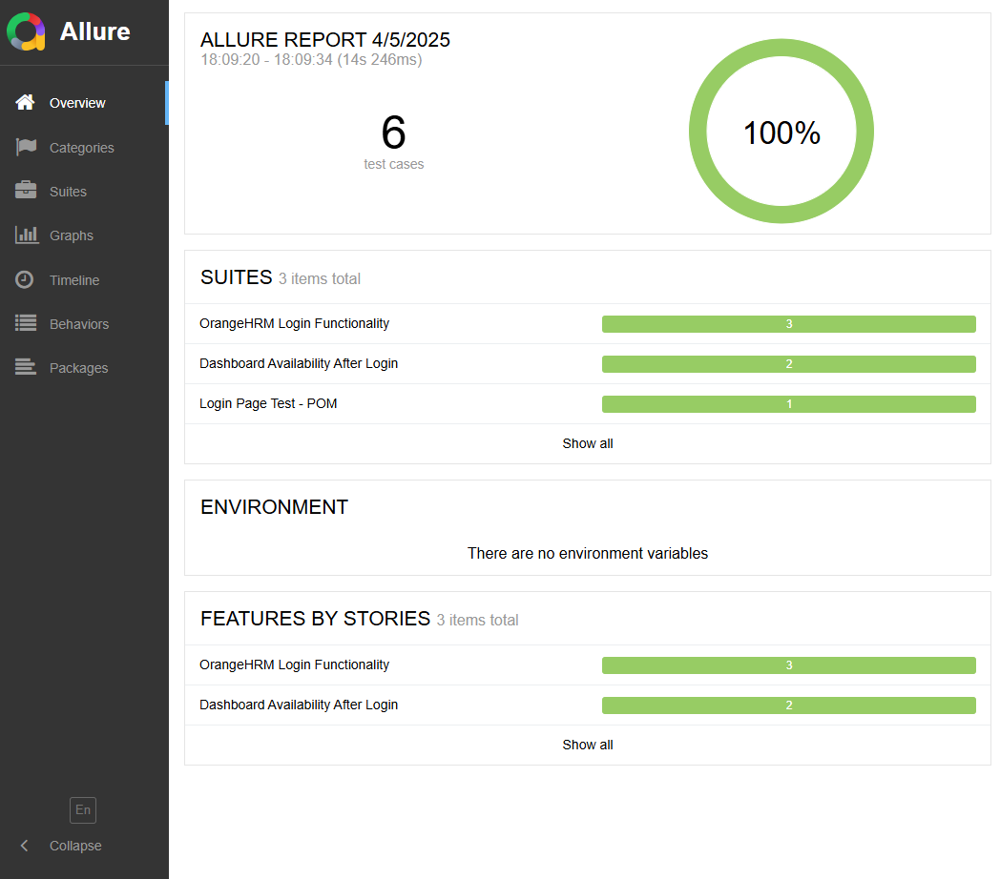

# 🚀 Cypress Login & Dashboard Automation with CI/CD, POM & GitHub Actions

[](https://jsaldaza.github.io/cypress-login-dashboard-ci-demo/)


Welcome to a professional end-to-end (E2E) test automation framework powered by **Cypress**, **Cucumber**, and the **Page Object Model (POM)**. This project demonstrates a clean, scalable structure for real-world web testing using [OrangeHRM](https://opensource-demo.orangehrmlive.com/) as the test target.

Whether you're a beginner or looking to scale your test suite with CI/CD, this framework is designed to be **educational, reusable, and enterprise-ready**.

---

## 🚀 Tech Stack

| Tool/Tech                         | Purpose                           |
|----------------------------------|-----------------------------------|
| [Cypress](https://www.cypress.io/)                 | E2E test runner                    |
| [Cucumber](https://cucumber.io/) + [Gherkin](https://cucumber.io/docs/gherkin/reference/) | BDD syntax for readable scenarios |
| Page Object Model (POM)          | Code abstraction and maintainability |
| [GitHub Actions](https://github.com/features/actions)         | CI/CD automation                   |
| `.env` + GitHub Secrets          | Secure credentials handling       |
| [Allure Reports](https://docs.qameta.io/allure)   | Beautiful historical test reports  |

---

## 📁 Project Structure

```bash
cypress-login-dashboard-ci-demo/
├─ cypress/
│  ├─ e2e/
│  │  ├─ login/
│  │  │  ├─ login.feature      # Gherkin scenarios
│  │  │  └─ login.js           # Step definitions
│  │  ├─ dashboard/
│  │  │  ├─ dashboard.feature
│  │  │  └─ dashboard.js
│  ├─ support/
│  │  ├─ pageObjects/
│  │  │  ├─ loginPage.js
│  │  │  └─ dashboardPage.js
│  │  ├─ commands.js
│  │  └─ e2e.js
├─ .github/workflows/
│  └─ cypress.yml              # GitHub Actions CI config
├─ .env                        # Local credentials (ignored)
├─ .env.example                # Safe example for contributors
├─ .gitignore
├─ cypress.config.js
└─ package.json
```

---

## 🗓️ Features Automated

### Login Scenarios:
- [x] Login using `.env` credentials
- [x] Login using Scenario Outline (data-driven)
- [x] Invalid login attempt validations

### Dashboard Validation:
- [x] Dashboard route check `/dashboard`
- [x] Multi-language header validation (Dashboard / Pizarra de pendientes)
- [x] Widget visibility: "My Actions", "Time at Work"

---

## 🧠 Learning Path

This repository is structured to support progressive learning:

- [x] Cypress with Cucumber integration
- [x] Page Object Model refactor
- [x] Environment variable handling via `.env` and GitHub Secrets
- [x] Login + Dashboard E2E flow
- [x] GitHub Actions CI setup
- [x] Allure Reports integration with historical builds
- [ ] 🔜 Advanced flows (Leave requests, Buzz, PIM)
- [ ] 🔜 Visual testing or API validations

---

## ⚙️ Setup Instructions

### 1. Install dependencies:
```bash
git clone https://github.com/jsaldaza/cypress-login-dashboard-ci-demo
cd cypress-login-dashboard-ci-demo
npm install
```

### 2. Add environment credentials:

Create a `.env` file in your project root:

```env
CYPRESS_username=Admin
CYPRESS_password=admin123
```

> ✅ **Note:** This file is in `.gitignore` to keep credentials secure.
> ⚠️ **Note:** These credentials are only valid for the OrangeHRM public demo site.

### 3. Run tests locally:
```bash
npx cypress open                 # Interactive UI mode
npx cypress run --env allure=true  # Headless run + Allure results
```

---

## 📊 Test Reports with Allure

Allure Reports are generated with beautiful trend history and visual charts.

To generate and open the report after a run:
```bash
npm run test:allure
```

Which includes:
```bash
npx cypress run --env allure=true
npx allure generate allure-results --clean -o allure-report
npx allure open allure-report
```

> 🧠 Tip: Historical test trends are preserved between builds using GitHub Actions artifacts.

> 📅 View the live report: [Allure Report on GitHub Pages](https://jsaldaza.github.io/cypress-login-dashboard-ci-demo/)

## 📸 Report Preview



---

## 🚀 Continuous Integration

Tests are executed on every push and pull request to `main` or `develop` using GitHub Actions.

Secrets used:
- `CYPRESS_username`
- `CYPRESS_password`

Stored in:
> **GitHub** → Settings → Secrets and variables → Actions

---

## 💡 Pro Tips

- ✅ Use `npm run test:allure` to run and preview Allure locally.
- 🧪 Add `--env allure=true` to any test run to generate Allure results.
- 🧠 Use `.env` + GitHub Secrets to avoid exposing credentials in code.
- 🚀 Share the public Allure link with team members for easy access.
- 📀 Historical trends are automatically preserved between CI builds.
- 📆 Keep the `allure-results` folder out of version control (`.gitignore`).

---

## 🔗 Useful Links
- [Official Cypress Docs](https://docs.cypress.io/)
- [Cucumber Preprocessor for Cypress](https://github.com/badeball/cypress-cucumber-preprocessor)
- [Page Object Pattern](https://martinfowler.com/bliki/PageObject.html)
- [GitHub Actions Documentation](https://docs.github.com/actions)
- [Allure Docs](https://docs.qameta.io/allure/)

---

## 🙌 Author

Built by [@jsaldaza](https://github.com/jsaldaza) with the goal of sharing Cypress testing knowledge and best practices.

> If this project helped you learn something, consider giving it a star!

---

## 📱 License

MIT License. Feel free to fork and contribute!

